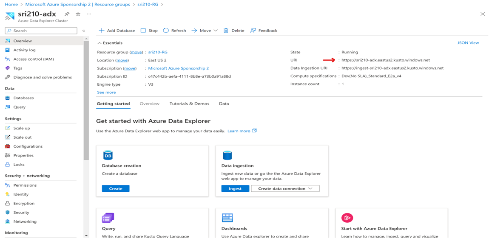
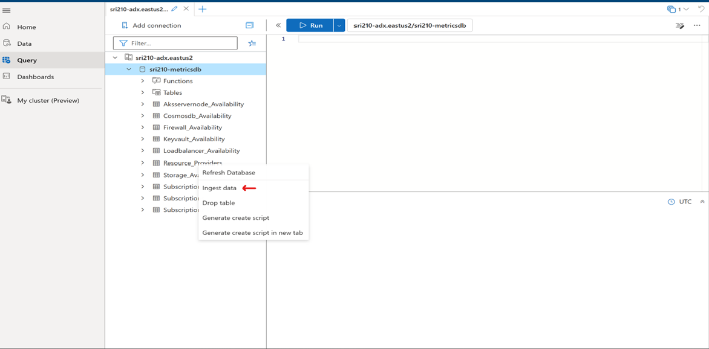
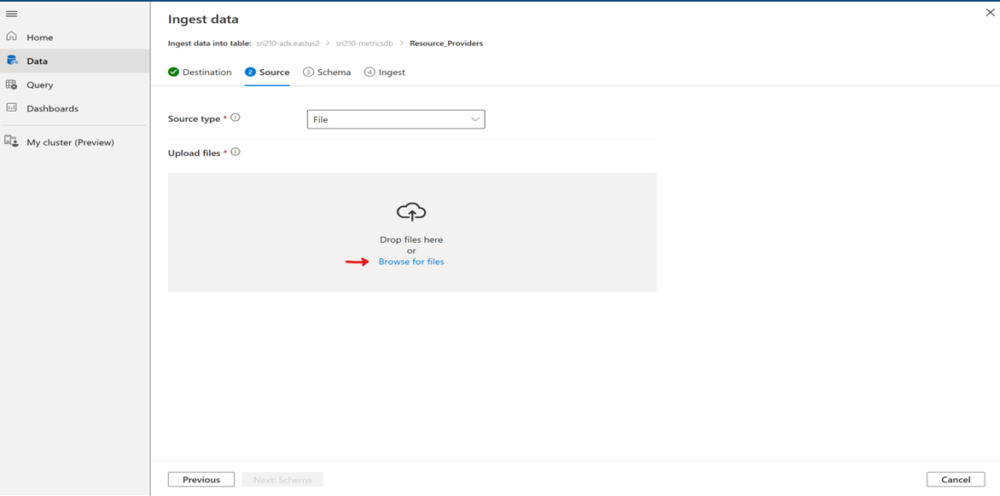
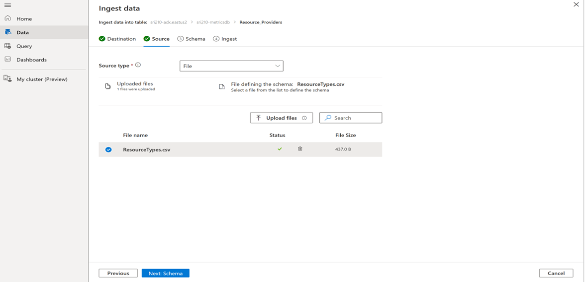
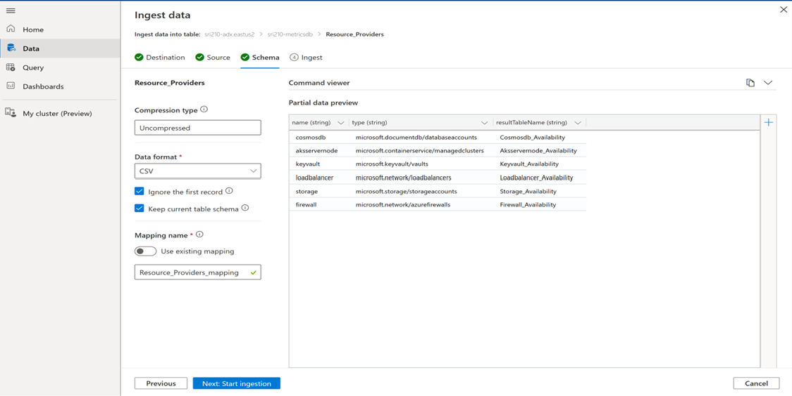
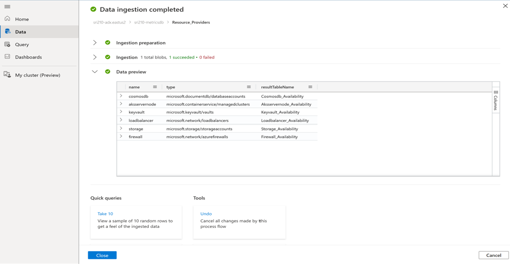

- Navigate to the ADX cluster [dataingestion 1](Images/dataingestion-1.png)

 

 - Open the ADX data explorer [dataingestion 2](Images/dataingestion-2.png)

 - Ingest the downloaded csv [dataingestion 3](Images/dataingestion-3.png)

 - Upload the locally downloaded resourceType.csv [dataingestion 4](Images/dataingestion-4.png)

[dataingestion 5](mages/dataingestion-5.png)

 - Verify if the schema looks good. [dataingestion 6](Images/dataingestion-6.png)

 
 - Verify if the ingestion was successful [dataingestion 7](Images/dataingestion-7.png)

