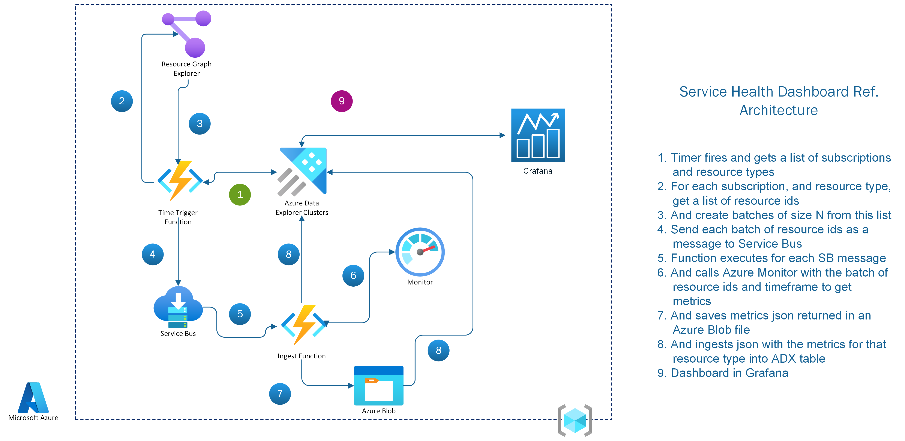
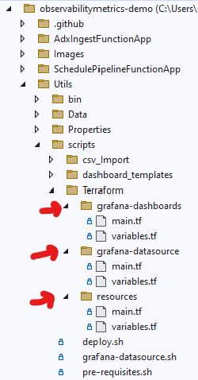
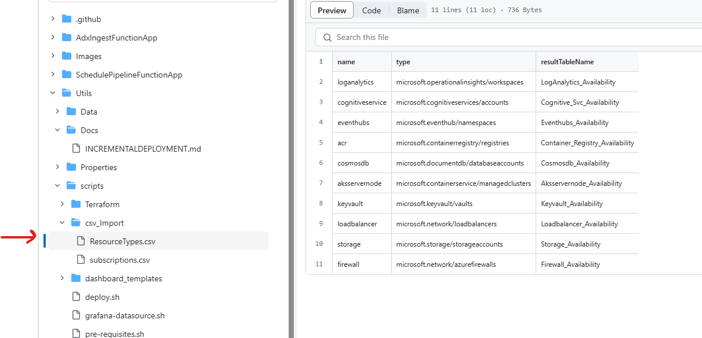
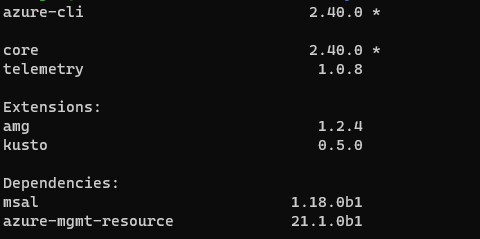

# Solution Approach to Observability

This repository contains reference architecture, code sample and dashboard template for tracking Azure resources availability (uptime/downtime) trends.

## Architecture

The following diagram gives a high-level view of Observability solution. You may download the Visio file from [here](Images/architecture-raw.vsdx)



1. Timer fires and gets a list of subscriptions and resource types�
2. For each subscription, and resource type, get a list of resource ids
3. And create batches of size N from this list
4. Send each batch of resource ids as a message to Service Bus
5. Function executes for each SB message
6. And calls Azure Monitor with the batch of resource ids and timeframe to get metrics
7. And saves metrics json returned in an Azure Blob file
8. And ingests json with the metrics for that resource type into ADX table
9. Dashboard in Grafana

Unlike Azure Monitor, which provides the average availability of one resource at a time, this solution provides the average availability of all resources of the same resource type in your subscriptions. For example, instead of providing the availability of one Key Vault, this solution will provide the average availability of all Key Vaults in your subscriptions.

## Components

The above diagram consists of a range of Azure components, which will be further outlined below.

[**Azure Data Explorer Clusters**](https://learn.microsoft.com/en-us/azure/data-explorer/data-explorer-overview) End-to-end solution for data ingestion, query, visualization, and management. Also used as the time series database for the availability metrics

[**Resource Graph Explorer**](https://learn.microsoft.com/en-us/azure/governance/resource-graph/overview) Enables running Resource Graph queries directly in the Azure portal.

[**Service Bus**](https://learn.microsoft.com/en-us/azure/service-bus-messaging/service-bus-messaging-overview) Decouples applications and services from each other, to allow for load-balancing and safe data transfer.

[**Ingest Function**](https://learn.microsoft.com/en-us/azure/azure-functions/functions-overview?pivots=programming-language-csharp) Loads data records from one or more sources into a table in Azure Data Explorer. Once ingested, the data becomes available for query.

[**Grafana**](https://learn.microsoft.com/en-us/azure/managed-grafana/overview) Azure managed Grafana to visualize the availability metrics

[**Azure Blob**](https://learn.microsoft.com/en-us/azure/storage/blobs/storage-blobs-introduction) Object storage solution for the cloud. Optimized for storing massive amounts of unstructured data.

## Availability Metrics

The following availability metrics are supported by Azure Monitor. This version of the solution queries only these metrics

The following availability metrics are supported by Azure Monitor. This version of the solution queries only these metrics.

| Resource Type   | Metric Name(Azure Monitor)  |  Availability metric calculation  |
|--------------- |---------------------------------------------------------------------------------------------------------------------------------------------- | -------------------------- |
| AKS Server Node  | [kube_node_status_condition](https://learn.microsoft.com/en-us/azure/azure-monitor/essentials/metrics-supported#microsoftcontainerservicemanagedclusters)    | (Ready / (Ready + Not Ready)) x 100 |
| Load Balancer   | [VipAvailability](https://learn.microsoft.com/en-us/azure/azure-monitor/essentials/metrics-supported#microsoftnetworkloadbalancers)            | - |
| Firewall       | [FirewallHealth](https://learn.microsoft.com/en-us/azure/azure-monitor/essentials/metrics-supported#microsoftnetworkazurefirewalls)            | - |
| Storage        | [Availability](https://learn.microsoft.com/en-us/azure/azure-monitor/essentials/metrics-supported#microsoftclassicstoragestorageaccounts)      | - |
| Cosmos DB       | [ServiceAvailability](https://learn.microsoft.com/en-us/azure/azure-monitor/essentials/metrics-supported#microsoftdocumentdbdatabaseaccounts)  | - |
| Key Vault       | [Availability](https://learn.microsoft.com/en-us/azure/azure-monitor/essentials/metrics-supported#microsoftkeyvaultvaults) | - |
| Cognitive Services  | [SuccessRate](https://learn.microsoft.com/en-us/azure/azure-monitor/essentials/metrics-supported#microsoftcognitiveservicesaccounts) | - |
| Event Hubs       | [IncomingRequests, ServerErrors](https://learn.microsoft.com/en-us/azure/event-hubs/monitor-event-hubs-reference)                     | ((IncomingRequests - ServerErrors) / IncomingRequests) x 100 |
| Container Registry       | [Successful/Total Push, Successful/Total Pull](https://learn.microsoft.com/en-us/azure/container-registry/monitor-service-reference)                     | ((Successful Push + Pull)/(Total Push + Pull)) x 100 |

## Visualization

In this section, you will see how the Grafana dashboard displays availability metrics over a given timeframe for each queried resource type.


## Getting Started

The following section describes the Prerequisites and Installation steps to deploy the solution.

### Prerequisites

> Note: Azure Role Permissions: User should have access to create ManagedIdentity/Service Principal on the subscription

#### Environment

The script can be executed in Linux - Ubuntu 20.04 (VM, WSL).
###note: currently cloudshell is not supported since it uses az-cli > 2.46.0

### Installation using shell script
```
## Clone git repo into the folder
## TODO: Update github repo link variable

repolink=""
codePath=$"./observability"
git clone $repolink $codePath

## Please setup the following required parameters for the script to run:
## prefix - prefix string to identify the resources created with this deployment. eg: test
## subscriptionId - subscriptionId where the solution will be deployed to
## location - location where the azure resources will be created. eg: eastus
## currentDir - setup full current directory path to where code is cloned

# change directory to where the repo is cloned
cd $codePath

# set variables
prefix=""
subscriptionId=""
location=""
currentDir=$(pwd)

# install pre-requisites
bash $currentDir/Utils/scripts/pre-requisites.sh

# change directory to where scripts are located
cd $currentDir/Utils/scripts

# command to run
/bin/bash ./deploy.sh $prefix $subscriptionId $location $currentDir

eg: /bin/bash ./deploy.sh "test" "subscriptionIdguid" "eastus2" "/full/path/to/code"
```

### Install using Terraform
```
## Clone git repo into the folder
repolink=""
codePath=$"./observability"
git clone $repolink $codePath

## Please setup the following required parameters for the script to run:
## prefix - prefix string to identify the resources created with this deployment. eg: test
## subscriptionId - subscriptionId where the solution will be deployed to
## location - location where the azure resources will be created. eg: eastus

# change directory to where the repo is cloned
cd $codePath

# set current working directory
currentDir=$(pwd)

# install pre-requisites
bash $currentDir/Utils/scripts/pre-requisites.sh

#downgrade az-cli to use version < 2.46
apt-cache policy azure-cli
sudo apt-get install azure-cli=<version>-1~<Codename>
eg: sudo apt-get install azure-cli=2.46.0-1~focal (Codename - focal/bionic/bullseye etc)

# change directory to where Terraform main.tf is located
cd $currentDir/Utils/scripts/Terraform
```
#Note: if you are deploying feature improvements on top of an existing deployment, please copy over the tfstate files from the folders resources,grafana-datasource and grafana-dashboards from your existing deployment to the cloned repository
 
```
#log in to the tenant where the subscription to host the resources is present
az login

#list the subscriptions under the tenant
az account show

#set the subscription where the resources are to be deployed
az account set --subscription <subscriptionId>

## 1. Create resources using Terraform
cd resources

#initialize terraform providers
terraform init

# run a plan on the root file
terraform plan -var="prefix=<prefix>" -var="subscriptionId=<subscriptionId>" -var="location=<preferredLocation>" -parallelism=<count>
eg: terraform plan -var="prefix=test" -var="subscriptionId=00000000-0000-0000-0000-000000000000" -var="location=eastus" -parallelism=1

# run apply on the root file
terraform apply -var="prefix=<prefix>" -var="subscriptionId=<subscriptionId>" -var="location=<preferredLocation>" -parallelism=<count>
eg: terraform apply -var="prefix=test" -var="subscriptionId=00000000-0000-0000-0000-000000000000" -var="location=eastus" -parallelism=1
note: make sure to confirm resource creation with a "yes" when the prompt appears on running this command

# add "grafana admin" role to the user as described here - https://learn.microsoft.com/en-us/azure/managed-grafana/how-to-share-grafana-workspace?tabs=azure-portal

# create api key and export all variables
export TF_VAR_sp_client_secret=$(terraform output -raw sp_client_secret)
export TF_VAR_tenant_id=$(terraform output -raw tenant_id)
export TF_VAR_sp_client_id=$(terraform output -raw sp_client_id)
export TF_VAR_database_name=$(terraform output -raw database_name)
export TF_VAR_cluster_url=$(terraform output -raw cluster_url)
export TF_VAR_sp_object_id=$(terraform output -raw sp_object_id)
export TF_VAR_prefix=$(terraform output -raw prefix)
export TF_VAR_url=$(az grafana show -g $TF_VAR_prefix-RG -n $TF_VAR_prefix-grafana -o json | jq -r .properties.endpoint)
export TF_VAR_token=$(az grafana api-key create --key `date +%s` --name $TF_VAR_prefix-grafana -g $TF_VAR_prefix-RG -r editor --time-to-live 60m -o json | jq -r .key)

## 2. Update grafana instance to create datasource, folders and dashboards using Terraform
cd ../grafana-datasource

#initialize terraform providers
terraform init -upgrade

# run a plan on the root file
terraform plan

# run apply on the root file
terraform apply  

## 3. Update grafana instance to create folders and dashboards using Terraform
cd ../grafana-dashboards

#initialize terraform providers
terraform init -upgrade

# run a plan on the root file
terraform plan

# run apply on the root file
terraform apply  
```
### Post Installation
#### Post Installation Steps:

The solution relies on the following data to be present in the "Resource Provider and Subscriptions table" before it can be used to visualize the data. Follow the steps below to complete the post installation steps.

#### Updating Resource Types

1. Download the file - [ResourceTypes.csv](Utils/scripts/csv_import/ResourceTypes.csv) to insert the list of resource providers to be monitored in the Resource_Providers table.


> Note: While saving to local ensure that you save the file as a .csv, the default is set to .txt

2. Data ingestion: follow the steps described in the [link](DATAINGESTION.md)  to complete the data ingestion

#### Updating Subscriptions

1. Download the file - [subscriptions.csv](Utils/scripts/csv_import/subscriptions.csv)  to local
2. Modify the CSV to include details of the subscriptions for which you want to track resource health.
3. Follow the data ingestion steps as outlined in the previous instructions for ResourceType.csv file.

Finally, add "Monitoring Reader" role for the Managed Identity created by script to the subscriptions that you want to monitor

#### Grafana access

To add other users to view/edit the Grafana dashboard, follow [adding role assignment to managed grafana](https://learn.microsoft.com/en-us/azure/managed-grafana/how-to-share-grafana-workspace?tabs=azure-portal)

#### Storage access 

sas token - expires in a year need to update it

#### az grafana known issue with higher az cli versions
az grafana create not compatible with az cli versions > 2.46 ongoing issue - https://github.com/Azure/azure-cli-extensions/issues/6221, advice to use lower
versions of cli <=2.46 until the issue is resolved.



#### persisting tfstate files
please ensure you are storing the tfstate files in the following locations so that they can be used to deploy further improvements in the future

