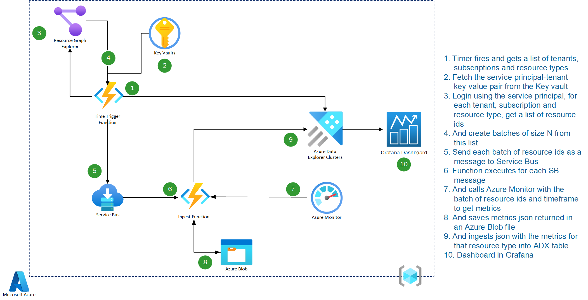
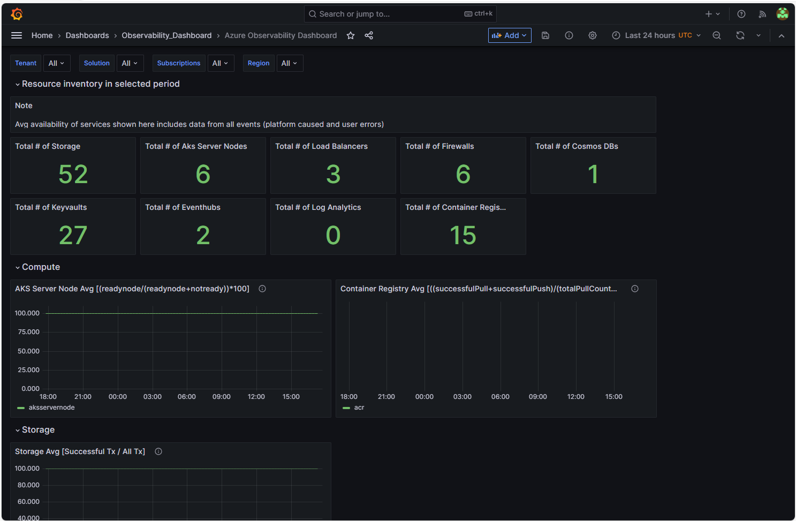
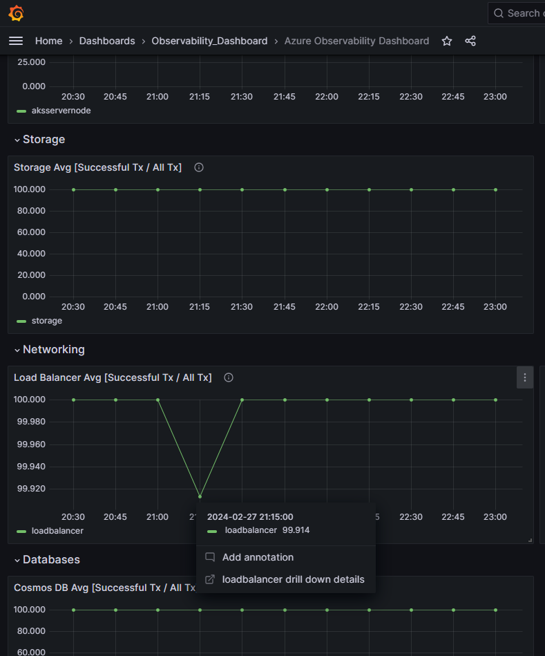
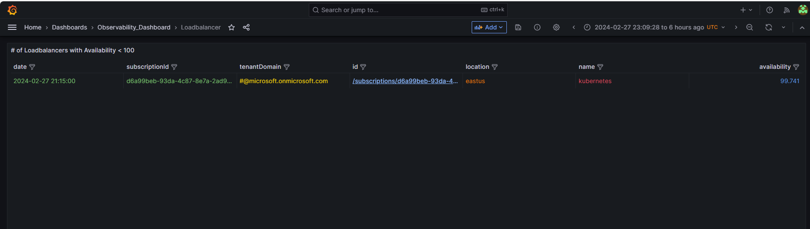
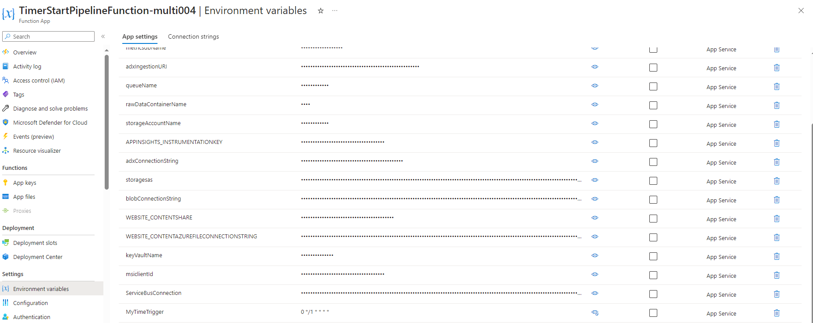

# Observability at Scale

This repository contains reference architecture, code sample and dashboard template for tracking Azure resources availability (uptime/downtime) trends.

This solution implements  the pillars of the [Microsoft Azure Well-Architected Framework](https://learn.microsoft.com/en-us/azure/well-architected/), which is a set of guiding tenets that you can use to improve the quality of a workload. One of the key considerations of the solution was the reliability pillar, which ensures that your application can meet the commitments you make to your customers. To support this, this solution helps to ensure that Azure applications are consistently reliable and meet the expectations of customers. In addition, this solution considers the operational excellence pillar, ensuring that processes can keep an application running in production. Together, these pillars come together to ensure that applications remain consistently available and reliable customers. For more information about these framework pillars, see [Overview of the reliability pillar](https://learn.microsoft.com/en-us/azure/well-architected/resiliency/overview) and [Overview of the operational excellence pillar](https://learn.microsoft.com/en-us/azure/well-architected/devops/overview).

## Features

#### Multi-tenant monitoring

This solultion allows you to track and filter resources across different tenants and subscriptions. Follow the steps in the post-installation section to set this up. 

#### Configurable near real time data pull

The frequency of availability data pulled can be adjusted down to one minute, or any other desired interval, by updating the MyTimeTrigger environment variable. Follow the steps in the post installation section to modify this value. 

#### Deep linking to Azure Portal

You can directly navigate to a resource's overview page in the Azure Portal by clicking on the underlined id field in the drill down menu.

## Architecture

The following diagram gives a high-level view of Observability solution. You may download the Visio file from [here](Images/architecture-multi-raw.vsdx)



Unlike Azure Monitor, which provides the average availability of one resource at a time, this solution provides the average availability of all resources of the same resource type in your subscriptions. For example, instead of providing the availability of one Key Vault, this solution will provide the average availability of all Key Vaults in your subscriptions.

## Components

The above diagram consists of a range of Azure components, which will be further outlined below.

[**Azure Data Explorer Clusters**](https://learn.microsoft.com/en-us/azure/data-explorer/data-explorer-overview) End-to-end solution for data ingestion, query, visualization, and management. Also used as the time series database for the availability metrics

[**Resource Graph Explorer**](https://learn.microsoft.com/en-us/azure/governance/resource-graph/overview) Enables running Resource Graph queries directly in the Azure portal.

[**Service Bus**](https://learn.microsoft.com/en-us/azure/service-bus-messaging/service-bus-messaging-overview) Decouples applications and services from each other, to allow for load-balancing and safe data transfer.

[**Ingest Function**](https://learn.microsoft.com/en-us/azure/azure-functions/functions-overview?pivots=programming-language-csharp) Loads data records from one or more sources into a table in Azure Data Explorer. Once ingested, the data becomes available for query.

[**Grafana**](https://learn.microsoft.com/en-us/azure/managed-grafana/overview) Azure managed Grafana to visualize the availability metrics

[**Azure Blob**](https://learn.microsoft.com/en-us/azure/storage/blobs/storage-blobs-introduction) Object storage solution for the cloud. Optimized for storing massive amounts of unstructured data.

[**Key Vault**](https://learn.microsoft.com/en-us/azure/key-vault/general/overview) Cloud-based service that allows you to securely store and manage cryptographic keys, secrets, and certificates used by your applications and services.

## Azure Monitor

This solution calls on the [Azure Monitor Batch API](https://learn.microsoft.com/en-us/rest/api/monitor/metrics-batch/batch?view=rest-monitor-2023-10-01&tabs=HTTP) to pull availability data for multiple resources within a subscription in one call. 

A sample request will look like this

```

POST "https://{region}.metrics.monitor.azure.com/subscriptions/{subscriptionID}/metrics:getBatch?timespan={timeSpan}&interval=PT1M&metricnames=Availability&aggregation=average&metricNamespace={resourceProvider}&autoadjusttimegrain=true&api-version=2023-03-01-preview"

```

With multiple resource IDs passed in the body of the request

```

{
  "resourceids": [
    "/subscriptions/12345678-abcd-1234-abcd-123456789abc/resourceGroups/TestGroup/providers/Microsoft.Storage/storageAccounts/TestStorage1",
    "/subscriptions/12345678-abcd-1234-abcd-123456789abc/resourceGroups/TestGroup/providers/Microsoft.Storage/storageAccounts/TestStorage2"
  ]
}

```

## Recommended SKU

The recommended SKU for this Kusto cluster is Standard_E8ads_v5. You can monitor this and scale up as needed by checking the application insights for the TimerStartPipelineFunction. You may see some 429 Kusto errors, meaning that your requests are being rate limited. The requests will wait some and be retried, so you should not experience data loss. However, it is best to scale up if you are seeing these errors to avoid further issues. 

Additionally, ensure that your tenant does not have any policies in place that would prevent Terraform from creating a client SP secret, or you will see an error in the deployment. 

## Availability Metrics

In Azure services, availability refers to the percentage of time that a service or application is available and functioning as expected.

The following availability metrics are supported by Azure Monitor. This version of the solution queries only these metrics.

| Resource Type   | Metric Name(Azure Monitor)  |  Availability metric calculation  |
|--------------- |---------------------------------------------------------------------------------------------------------------------------------------------- | -------------------------- |
| AKS Server Node  | [kube_node_status_condition](https://learn.microsoft.com/en-us/azure/azure-monitor/essentials/metrics-supported#microsoftcontainerservicemanagedclusters)    | (Ready / (Ready + Not Ready)) x 100 |
| Load Balancer   | [VipAvailability](https://learn.microsoft.com/en-us/azure/azure-monitor/essentials/metrics-supported#microsoftnetworkloadbalancers)            | - |
| Firewall       | [FirewallHealth](https://learn.microsoft.com/en-us/azure/azure-monitor/essentials/metrics-supported#microsoftnetworkazurefirewalls)            | - |
| Storage        | [Availability](https://learn.microsoft.com/en-us/azure/azure-monitor/essentials/metrics-supported#microsoftclassicstoragestorageaccounts)      | - |
| Cosmos DB       | [ServiceAvailability](https://learn.microsoft.com/en-us/azure/azure-monitor/essentials/metrics-supported#microsoftdocumentdbdatabaseaccounts)  | - |
| Key Vault       | [Availability](https://learn.microsoft.com/en-us/azure/azure-monitor/essentials/metrics-supported#microsoftkeyvaultvaults) | - |
| Event Hubs       | [IncomingRequests, ServerErrors](https://learn.microsoft.com/en-us/azure/event-hubs/monitor-event-hubs-reference)                     | ((IncomingRequests - ServerErrors) / IncomingRequests) x 100 |
| Container Registry       | [Successful/Total Push, Successful/Total Pull](https://learn.microsoft.com/en-us/azure/container-registry/monitor-service-reference)                     | ((Successful Push + Pull)/(Total Push + Pull)) x 100 |
| Log Analytics  | [AvailabilityRate_Query](https://learn.microsoft.com/en-us/azure/azure-monitor/reference/supported-metrics/microsoft-operationalinsights-workspaces-metrics) | - |

## Visualization

In this section, you will see how the Grafana dashboard displays availability metrics over a given time frame for each queried resource type.



You can also drill down to a more detailed view of the monitored resources and click on the ID field to navigate to the resource's overview page in Azure Portal. 






## Getting Started

The following section describes the Prerequisites and Installation steps to deploy the solution.

### Prerequisites

> Note: Azure Role Permissions: User should have access to create ManagedIdentity/Service Principal on the subscription

#### Environment

The script can be executed in Linux - Ubuntu 20.04 (VM, WSL).

> Note: currently Azure Cloud Shell is not supported since it uses az-cli > 2.46.0

### Install using Terraform

```bash
## Clone git repo into the folder
repolink=""
codePath=$"./observability"
git clone $repolink $codePath

## Please setup the following required parameters for the script to run:
## prefix - prefix string to identify the resources created with this deployment. eg: test
## subscriptionId - subscriptionId where the solution will be deployed to
## location - location where the azure resources will be created. eg: eastus

# change directory to where the repo is cloned
cd $codePath

# set current working directory
currentDir=$(pwd)

# install pre-requisites
bash $currentDir/Utils/scripts/pre-requisites.sh

#downgrade az-cli to use version < 2.46
apt-cache policy azure-cli
sudo apt-get install azure-cli=<version>-1~<Codename>
eg: sudo apt-get install azure-cli=2.46.0-1~focal (Codename - focal/bionic/bullseye etc)

# change directory to where Terraform main.tf is located
cd $currentDir/Utils/scripts/Terraform

```

> Note: if you are deploying feature improvements on top of an existing deployment, please copy over the tfstate files from the folders resources,grafana-datasource and grafana-dashboards from your existing deployment to the cloned repository


```bash

#log in to the tenant where the subscription to host the resources is present
az login

#list the subscriptions under the tenant
az account show

#set the subscription where the resources are to be deployed
az account set --subscription <subscriptionId>

## 1. Create resources using Terraform
cd resources

#initialize terraform providers
terraform init

# run a plan on the root file
terraform plan -var="prefix=<prefix>" -var="subscriptionId=<subscriptionId>" -var="location=<preferredLocation>" -parallelism=<count>
eg: terraform plan -var="prefix=test" -var="subscriptionId=00000000-0000-0000-0000-000000000000" -var="location=eastus" -parallelism=1

# run apply on the root file
terraform apply -var="prefix=<prefix>" -var="subscriptionId=<subscriptionId>" -var="location=<preferredLocation>" -parallelism=<count>
eg: terraform apply -var="prefix=test" -var="subscriptionId=00000000-0000-0000-0000-000000000000" -var="location=eastus" -parallelism=1
note: make sure to confirm resource creation with a "yes" when the prompt appears on running this command

# add "grafana admin" role to the user as described here - https://learn.microsoft.com/en-us/azure/managed-grafana/how-to-share-grafana-workspace?tabs=azure-portal

# run post installation script to set up some additional variables
sh post_install.sh

# create api key and export all variables
export TF_VAR_database_name=$(terraform output -raw database_name)
export TF_VAR_cluster_url=$(terraform output -raw cluster_url)
export TF_VAR_sp_object_id=$(terraform output -raw sp_object_id)
export TF_VAR_prefix=$(terraform output -raw prefix)
export TF_VAR_url=$(az grafana show -g $TF_VAR_prefix-RG -n $TF_VAR_prefix-grafana -o json | jq -r .properties.endpoint)
export TF_VAR_token=$(az grafana api-key create --key `date +%s` --name $TF_VAR_prefix-grafana -g $TF_VAR_prefix-RG -r editor --time-to-live 60m -o json | jq -r .key)

## 2. Update grafana instance to create datasource, folders and dashboards using Terraform
cd ../grafana-datasource

#initialize terraform providers
terraform init -upgrade

# run a plan on the root file
terraform plan

# run apply on the root file
terraform apply  

## 3. Update grafana instance to create folders and dashboards using Terraform
cd ../grafana-dashboards

#initialize terraform providers
terraform init -upgrade

# run a plan on the root file
terraform plan

# run apply on the root file
terraform apply  
```

### Post Installation

#### Post Installation Steps

The solution relies on the following data to be present in the "Resource Providers" and "Subscriptions" tables before it can be used to visualize the data. Follow the steps below to complete the post installation steps.

#### Updating Resource Types

1. Download the file - [ResourceTypes.csv](Utils/scripts/csv_Import/ResourceTypes.csv) to insert the list of resource providers to be monitored in the Resource_Providers table.


> Note: While saving to local ensure that you save the file with csv extension, the default is set to .txt

2. Data ingestion: follow the steps described in the [link](DATAINGESTION.md)  to complete the data ingestion

#### Updating Subscriptions

1. Download the file - [subscriptions.csv](Utils/scripts/csv_Import/subscriptions.csv)  to local
2. Modify the CSV to include details of the subscriptions and tenants for which you want to track resource health.
3. Follow the data ingestion steps as outlined in the previous instructions for ResourceType.csv file.

Finally, add "Monitoring Reader" role for the Managed Identity and Service Principal created by script to the subscriptions that you want to monitor within the tenant where you have deployed the solution.

#### Testing in Microsoft tenant (remove this before merging to main)
In order to test in the Microsoft tenant, navigate to the environment variables section of both Function Apps in Azure Portal. Click on Advanced edit to input the Microsoft tenant id as the value for the variable "msftTenantId"

This is required to use MSI rather than searching for a tenant SP credential in Key Vault and use the appropriate endpoint when calling the Azure Monitor API.

#### Enabling ingestion to ADX with MSI (remove this before merging to main)

Currently, the following command needs to be executed manually on the ADX cluster to enable native ingestion from storage with MSI.
```
.alter-merge cluster policy managed_identity "[{ 'ObjectId' : '%%%%', 'AllowedUsages' : 'NativeIngestion' }]"
```
The ObjectId of the ADX system-assigned identity should be inputted here. This ObjectId can be found by navigating to the ADX Cluster > Security + Networking > Identity in the Azure portal.

#### Monitoring Additional Tenants
In order to support monitoring of additional tenants, you will have add the appropriate service principal credentials to Key Vault. Follow the steps below to create and upload the client secrets.

1. Creating a Service Principal: follow the steps described to [create a multitenant app registration and client secret](https://learn.microsoft.com/en-us/entra/identity-platform/quickstart-register-app) in the tenant you would like to monitor.
3. Add the "Monitoring Reader" role for this Service Principal to any subscriptions which you would like to monitor within the tenant.
4. Upload the Service Principal credentials as a secret to Key Vault in the following format:

   Secret Name: tenant-[TenantId]
   
   Secret Value: {"ClientId":"[ServicePrincipalClientId]","ClientSecret":"[ServicePrincipalSecretValue]"}

#### Configuring near real-time monitoring
In order to update the frequency of pulling availability metrics, you can navigate to the app settings of the TimerStartPipelineFunction. Here, you can modify the MyTimeTrigger variable in environment variables as seen below to reduce to 1 minute, or your desired interval. 




#### Grafana access

To add other users to view/edit the Grafana dashboard, follow [adding role assignment to managed grafana](https://learn.microsoft.com/en-us/azure/managed-grafana/how-to-share-grafana-workspace?tabs=azure-portal)

#### Storage access

sas token - expires in a year need to update it

#### az grafana known issue with higher az cli versions

az grafana create not compatible with az cli versions > 2.46 ongoing issue - [https://github.com/Azure/azure-cli-extensions/issues/6221](https://github.com/Azure/azure-cli-extensions/issues/6221), advice to use lower
versions of cli <=2.46 until the issue is resolved.


#### persisting tfstate files

please ensure you are storing the tfstate files in the following locations so that they can be used to deploy further improvements in the future


#### Incremental Deployment on exisiting solution

Note: for MSFT Tenant, remove the secret in key vault in your existing deployment before incremental deployment, and save it(save name and secret value). Add it back to key vault manually after incremental deployment is finished.

1. clone the new branch
2. go to /mcsa-observability/Utils/scripts/Terraform/resources of the exisitng deployed branch and copy the terraform.tfstate file and paster over to the same directory of the new undeployed branch
3. follow through all the steps of previous deployment instruction 