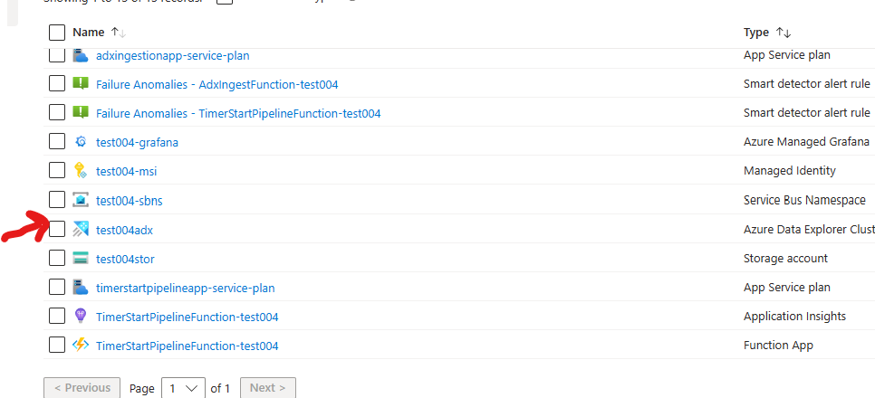
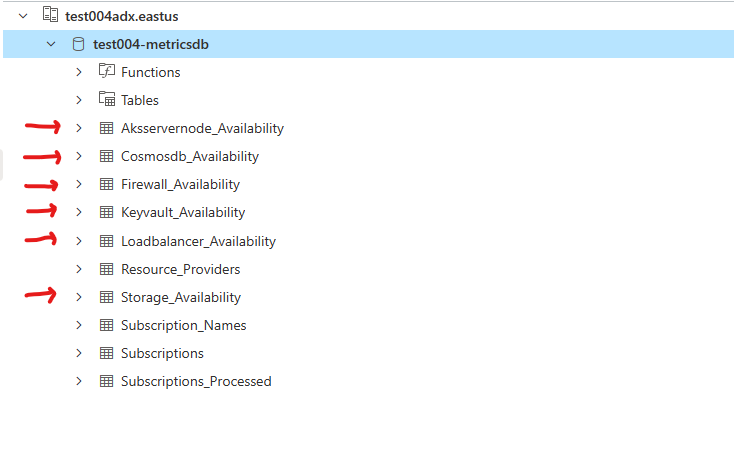

Note :

If the date on the wsl is incorrect (not in sync with the system clock) this can make scripts fail with unclear messages. To fix do the following:

	1. Check date and time by running "date"

	2. If out of sync run " sudo hwlock -s"

	3. Check if date is not correct. If not try a couple more times.

	4. If that does not work then run "apt install ntp"

	5. And then "ntpdate -u "in.pool.ntp.org"

Based on your setup take either of the below steps:

	1. If tfstate file from previous state is deleted.

	2. If tfstate file from previous state is available.

##1. tfstate files are deleted

    a. Login to the azure portal and navigate to ADX tables in the deployed resource group

	b. Export the following database tables as CSVs

			
	c. Follow the steps to deploy the infrastructure as detailed here:
1. [#install-using-terraform | Azure-Samples/observabilitymetrics-demo](https://github.com/Azure-Samples/observabilitymetrics-demo/tree/main#install-using-terraform)

2. Post installation

	- Before performing the post installation steps import the CSVs that we exported in step b above into the respective tables in the newly created ADX tables

	- [#post-installation | Azure-Samples/observabilitymetrics-demo](https://github.com/Azure-Samples/observabilitymetrics-demo/tree/main#post-installation)

d. Wait for 15-30 minutes for the data to populate in the grafana instance.

##2. tfstate file from previous state is available
		a. Copy over tfstate files from folders resources, grafana-datasource and grafana-dashboard

		b. Run the steps for terraform deployment as detailed here
		
- [#install-using-terraform | Azure-Samples/observabilitymetrics-demo](https://github.com/Azure-Samples/observabilitymetrics-demo/tree/main#install-using-terraform)

	- Be sure to use the same arguments you did originally so that you deploy upgrades to the same subscription, resource group: prefix, subscriptiontId, location.

- [#post-installation | Azure-Samples/observabilitymetrics-demo](https://github.com/Azure-Samples/observabilitymetrics-demo/tree/main#post-installation)

	c. Store the generated tfstate files in a permanent storage so that newer features can be installed on top of existing deployments in the future.

